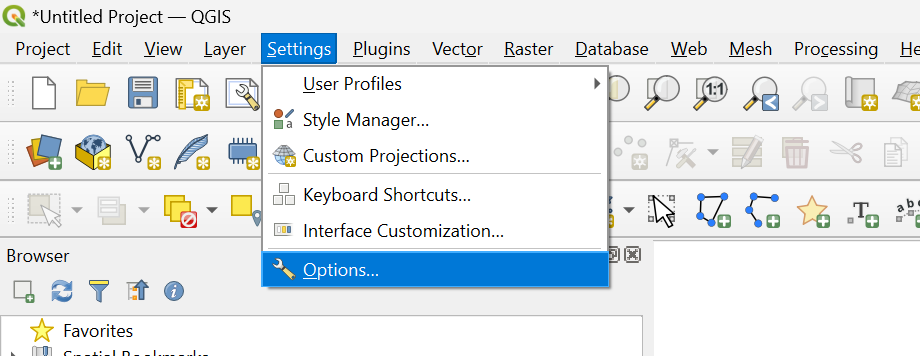
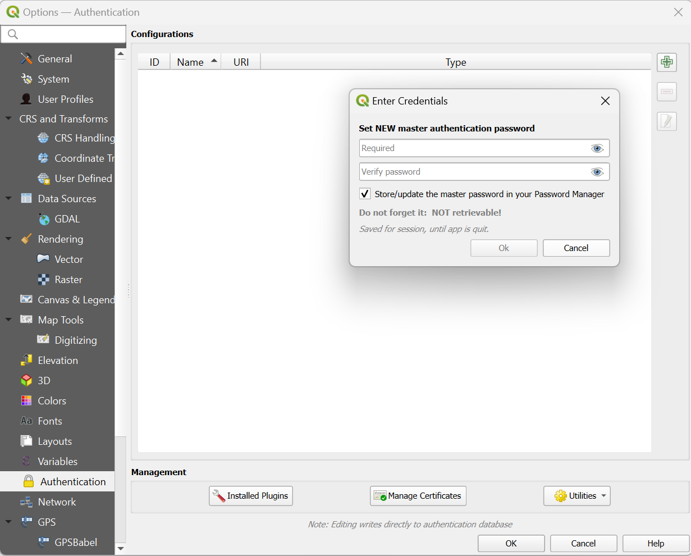
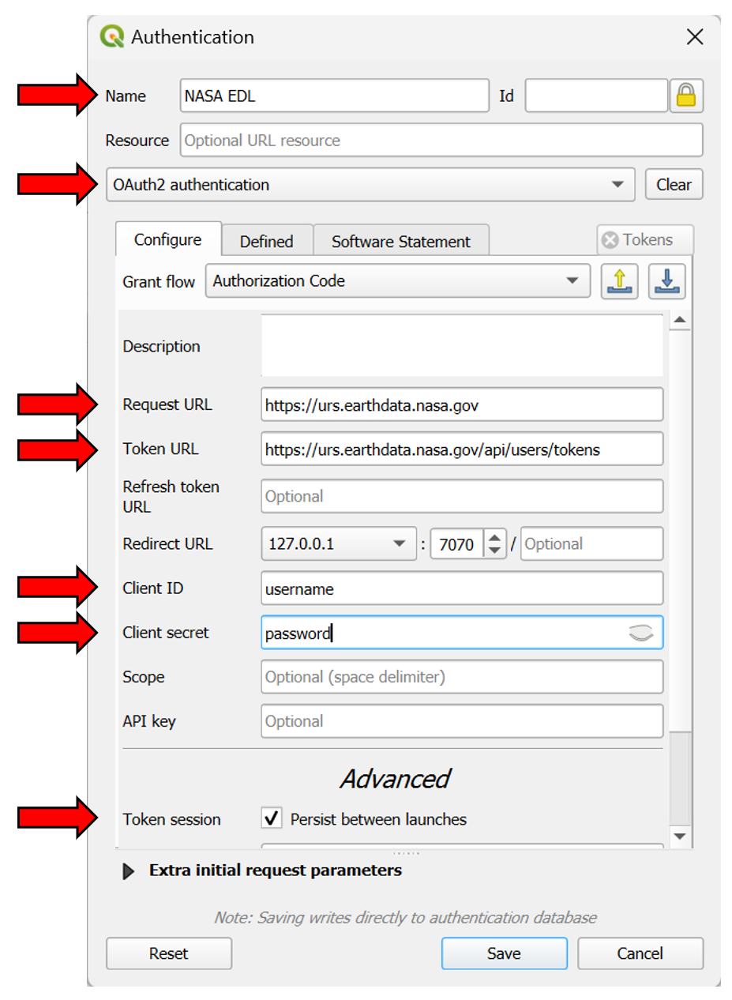
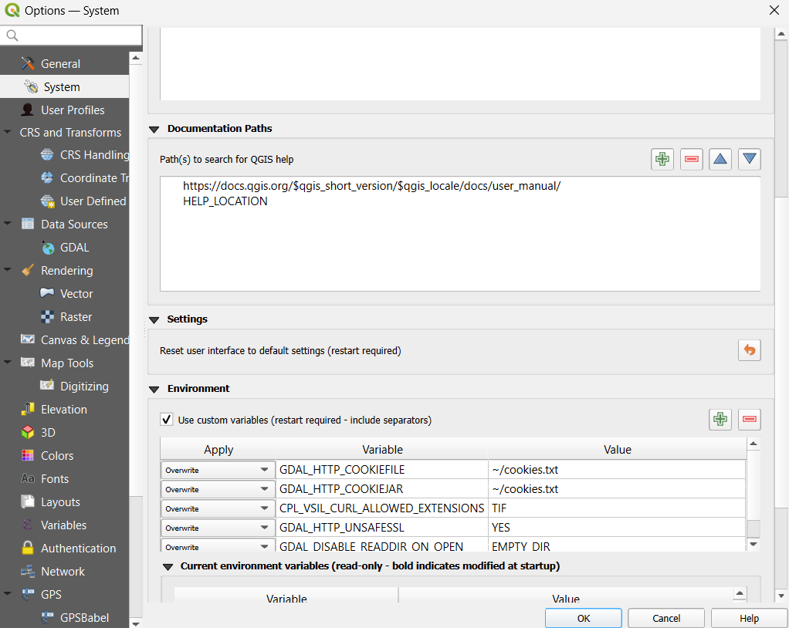
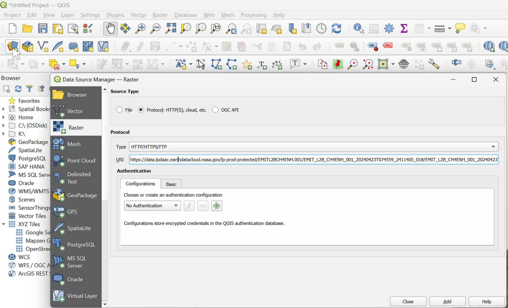
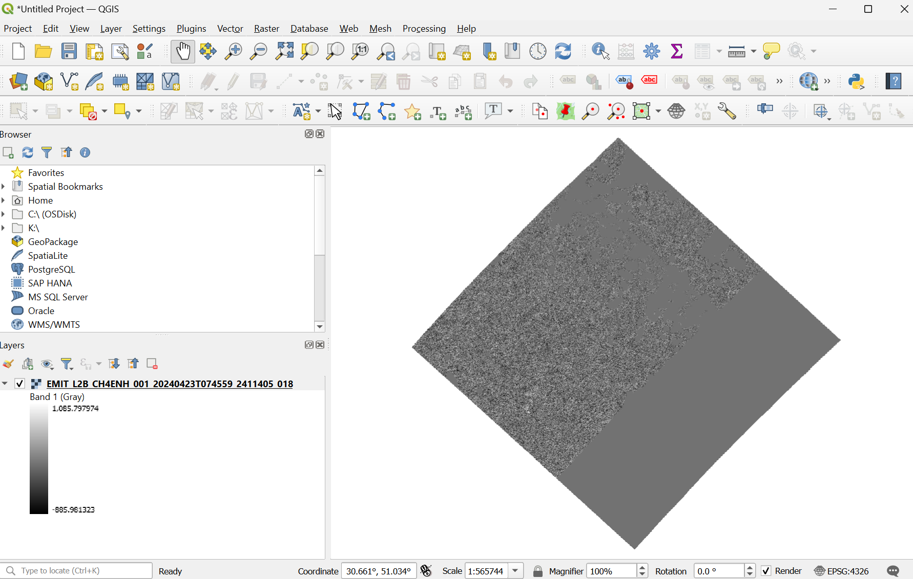

# Streaming NASA Earthdata Cloud-Optimized Geotiffs using QGIS

**Note:** Users must have [NASA Earthdata Login](https://urs.earthdata.nasa.gov/home) to stream data.

QGIS can be used to stream NASA Earthdata cloud-optimized geotiff files. To do this QGIS uses https and the vsicurl virtual file system handler. This guide will show you how to configure QGIS to do this. There are 4 steps needed.

1. Configure QGIS Authentication
2. Add Custom Environment Variables
3. Restart QGIS
4. Add Data

## 1. Configure QGIS Authentication

After opening QGIS open the options sub-menu from the settings menu.

Select the Authentication tab on the left-hand side and then the plus sign to add a new authentication configuration. When you do this, you will be prompted to set a master password for all of your QGIS authentications to protect credentials. Create a strong password and be sure to remember or keep it in a safe location.

After this, you will be able to add an authentication entry. You can name this 'NASA EDL' and select 'OAuth2 authentication' as the type from the dropdown. This will expand the configuration options, where you can enter the following information:

Request URL: <https://urs.earthdata.nasa.gov>
Token URL: <https://urs.earthdata.nasa.gov/api/users/tokens>
Client ID: Your NASA Earthdata Login username
Client Secret: Your NASA Earthdata Login password

Lastly, you can also check the box under advanced to persist between launches.

## 2. Environment Settings

Next, while still in the settings menu, select system on the left-hand side, then scroll down Environment. Select the check box and enter the Variables and Values in the table below by clicking the plus sign to add a new variable. These variables, set up a place for cookies to be stored and read from, prevent GDAL from reading all files in the directory, specify the extensions GDAL is allowed to access over HTTPS using the vsicurl virtual file system handler, and allow use of unsafe SSL connections (use with caution).

|Variable|Value|
| ----------- | ----------- |
|GDAL_HTTP_COOKIEFILE|~/cookies.txt|
|GDAL_HTTP_COOKIEJAR|~/cookies.txt|
|GDAL_DISABLE_READDIR_ON_OPEN|EMPTY_DIR|
|CPL_VSIL_CURL_ALLOWED_EXTENSIONS|TIF|
|GDAL_HTTP_UNSAFESSL|YES|

> **Note: These settings may affect streaming from other data sources.**

## 3. Restart QGIS

Restart QGIS to load the new environment settings.

## 4. Add Some Data

To add some raster data, select the add raster data button from the toolbar, select 'Protocol: HTTP(S), cloud, etc' as the source type, then enter a URI for a cloud-optimized geotiff file and press the add button. For example:

`https://data.lpdaac.earthdatacloud.nasa.gov/lp-prod-protected/EMITL2BCH4ENH.001/EMIT_L2B_CH4ENH_001_20240423T074559_2411405_018/EMIT_L2B_CH4ENH_001_20240423T074559_2411405_018.tif`

This should add the data to your map, and will work with any NASA Earthdata hosted cloud-optimized geotiff file.

## Contact Info  

Email: <LPDAAC@usgs.gov>  
Voice: +1-866-573-3222  
Organization: Land Processes Distributed Active Archive Center (LP DAAC)¹  
Website: <https://lpdaac.usgs.gov/>  
Date last modified: 06-19-2024  

¹Work performed under USGS contract 140G0121D0001 for NASA contract NNG14HH33I.  
